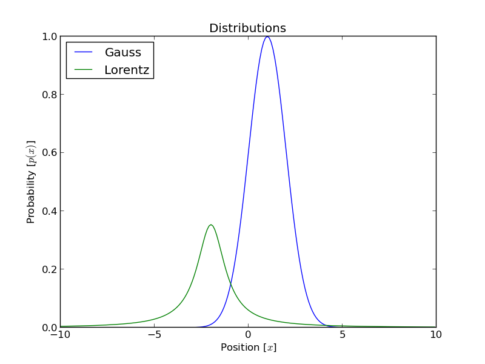
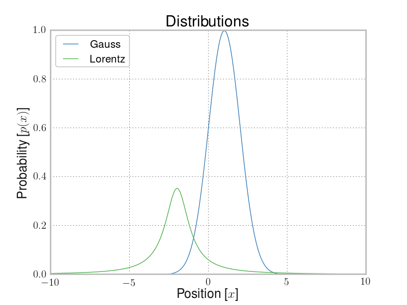

# Matplotlib Header

Simple matplotlib header for making your plots more visual pleasing.
Similarly to [prettyplot](https://github.com/olgabot/prettyplotlib).
Difference is this is really just a `.py` file you import, that changes some of the default values of matplotlib.
Nothing fancy.

This is based on [matplotlib.org/users/customizing.html](http://matplotlib.org/users/customizing.html).

## Font Choice

Most journals want either sans-serif or specifically Arial/Helvetica.

## Color Choice

I dislike the default colors in matplotlib (who doesn't), so I changed them to some colors which are still clear, but doesn't make you vomit.

## Examples

Description | Default MPL | `mpl_header`
--- | --- | ---
XY plot with some distributions |  |  
Scatter plot |  |  
2D colormap plot | `example_before.png` | `example_after.png`

